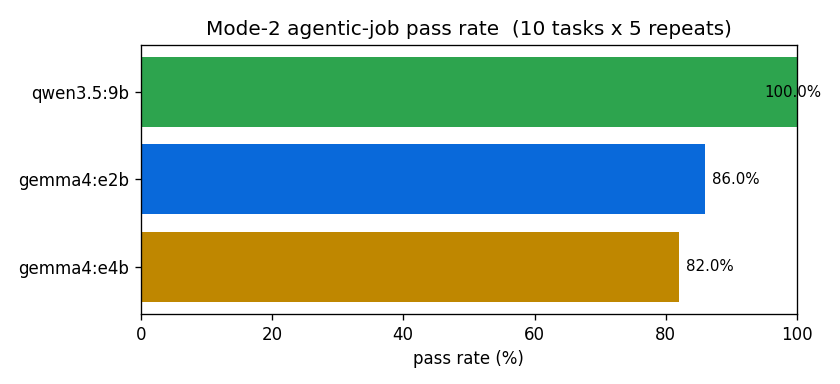
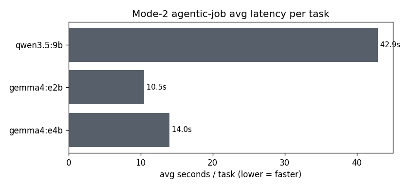
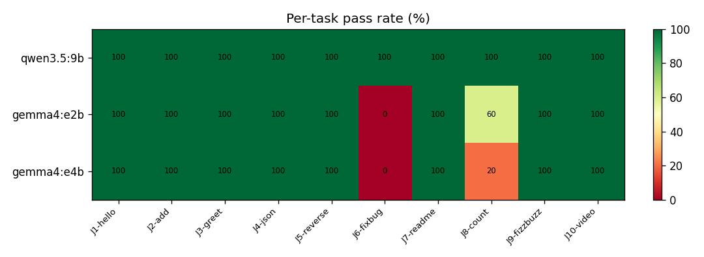

# agentica-core

> Repo being renamed `slurm-open-agentic` → **agentica-core** (the backend/runtime
> for the [Agentica](../Agentica) UI). The Python package is `agentica_core` and the
> CLI is `agentica` (`slurm-agentic` still works as an alias). To finish the rename:
> rename the GitHub repo, then `mv slurm-open-agentic agentica-core` locally.

Run **open-weight agentic AI + chat on local, SSH, or SLURM targets** described by a
`cluster.yaml` or a bare `~/.ssh/config` alias. Built on [AgenticLocal](../AgenticLocal)'s
`agentic_loop` engine (`agent = model + state + tools + policy loop`).

## Agentica UI + JSON API

[Agentica](../Agentica) (React + Vite) is the unified **agentic + chat** console with
a **plan editor** (per-line edit + comments → refine → submit). It talks to this
backend's JSON API:

```
agentica serve-api --model llama3.2:3b        # http://127.0.0.1:8770/api/*
#   GET  /api/hosts            local + every ~/.ssh/config server
#   POST /api/chat             {message, mode: agentic|plain, workspace?}
#   POST /api/plan/draft       {goal}            -> editable plan lines + tests
#   POST /api/plan/refine      {plan, comments}  -> revised plan
#   POST /api/job/submit       {plan, target}    -> local thread OR ssh/SLURM sbatch
#   GET  /api/job/status|logs
```

The two CLI modes below still work standalone:

1. **Interactive gateway** — a localhost ChatGPT-like web chat + an OpenAI-compatible
   `/v1` API (for VS Code / Continue / Cline), backed by a model served on a remote
   GPU node reached over an SSH tunnel. The agent loop runs locally; only inference
   is remote.
2. **Agentic job** — submit a `plan.yaml` to SLURM as a batch job that drives a
   **Planner → Executor → Auditor** loop to completion, with deterministic
   test/artifact backstops the model can't override.

```
pip install -e .            # also: pip install -e ../AgenticLocal
slurm-agentic up examples/cluster.yaml                 # web chat + /v1 backed by the cluster
slurm-agentic job submit examples/cluster.yaml examples/plans/code_experiment.yaml
```

## Target any server in your ~/.ssh/config

The cluster target can be a full `cluster.yaml` **or a bare ssh alias** — connection
(HostName, User, Port, IdentityFile, **ProxyJump hops**, ForwardAgent) is inherited
from your `~/.ssh/config`, so nothing is duplicated. SLURM clusters and plain GPU
boxes are auto-detected (`scheduler: auto` → probes for `sbatch`).

```
slurm-agentic hosts                          # list servers from ~/.ssh/config
slurm-agentic discover discovery.usc.edu     # probe scheduler + partitions + GPUs -> draft yaml
slurm-agentic up syrah                        # plain GPU box (no SLURM): ollama over ssh + tunnel
slurm-agentic job submit examples/discovery.yaml examples/plans/discovery_smoke.yaml
```

For a multi-hop cluster, either rely on the `ProxyJump` in your ssh config, or set
`ssh: { host: <alias>, proxy_jump: <bastion> }` in the yaml. `setup:` lines (e.g.
`module load ...`, putting a user-space ollama on `PATH`) run at the top of every
sbatch on the compute node — see [examples/discovery.yaml](examples/discovery.yaml).

### Verified on a real cluster (USC CARC Discovery)

Run end-to-end on **Discovery** (SLURM 25.05) over the `~/.ssh/config` alias, with a
rootless Ollama staged on `/scratch1` (no admin) and `llama3.2:3b`:

```
slurm-agentic discover discovery.usc.edu
#  scheduler: slurm · partitions: [debug, gpu, main, ...] · gpu_types: [a100, a40, l40s, p100, v100]

slurm-agentic job submit examples/discovery_debug.yaml examples/plans/discovery_smoke.yaml
#  [submitted] job_id=9210485
slurm-agentic job status examples/discovery_debug.yaml --job 9210485 --jobdir <...>
#  job 9210485: state=COMPLETED · result: passed=True iterations=1 tests_ok=True
```

On a40 node `b11-09` the on-node Planner→Executor→Auditor loop wrote `hello.txt`
("hello from discovery") and the deterministic `grep` backstop passed — a real
agentic job carried to completion on the cluster. (Lesson baked into the config:
the old **P100 is too slow** for the default 120s request timeout — raise
`model.timeout_s`, or use a40/a100/l40s. The busy `gpu` queue was ~6h out, so the
short `debug`-partition job backfilled in seconds.)

## Model deployment / GPU sizing

The framework checks **model-vs-GPU fit** before serving and ships a validated
**library** of working `(model, gpu, quant)` configs (default leans to popular
models like `qwen3.6`):

```
slurm-agentic fit qwen3-235b-a22b a100-80 --count 2 --quant int4   # does it fit?
slurm-agentic library --gpu l40s                                   # working configs + a default
```

Key facts baked into `catalog.py`:

- **Size MoE by TOTAL params** (all experts stay resident).
- **Native FP8 is Ada (L40S) / Hopper only** — on A40/A100 use **BF16 or INT4 (AWQ/GPTQ)**.
- `preflight_fit()` computes `weights + KV + overhead` vs `gpus × VRAM × util` and
  refuses/advises (more GPUs, smaller quant, lower `max_model_len`, or smaller model).
- For very large models: **tensor/pipeline/expert-parallel** (one model sharded across
  GPUs/nodes) vs **replicas** (independent copies for throughput).

| Local default (1 GPU) | Big-but-feasible | Video + image (1×48GB) |
|---|---|---|
| Gemma 3 27B / Qwen3-32B INT4 | GLM-4.5-Air INT4 @1×A100-80; gpt-oss-120b @2×A100-80 | FLUX.1-schnell + Wan2.2-TI2V-5B (ComfyUI) |

## Layout

```
agentica_core/
  config.py        cluster.yaml / plan.yaml schemas
  catalog.py       GPU+model catalog, preflight_fit(), validated preset library
  transport.py     sync ssh/scp/rsync + sbatch/squeue/scancel + tunnel ctx mgr
  serving.py       bring up ollama/vLLM on a node, readiness, preflight
  gateway.py       Mode 1: web chat + /v1 (passthrough|agentic) + Bearer auth
  webchat.py       ChatGPT-like browser page (history + copy-API)
  slurm_tools.py   run_shell/run_tests/check_artifact/submit_for_audit/generate_*
  workflows.py     Planner/Executor/Auditor workflows (seeded into the registry)
  on_node_runner.py  Mode 2 auditor outer loop (runs inside the SLURM job)
  job.py           Mode 2: submit/status/logs/cancel/fetch
  cli.py           `slurm-agentic` entrypoint
```

## Testing without a cluster

`tests/` runs fully offline: `Transport.local()` + fake `sbatch`/`squeue` shims,
the `rule`/scripted model through the auditor loop, the preset-library fit check,
and the workflow-resolution regression. Run: `python -m pytest tests/ -q`.

<!-- BENCH:START -->
## Benchmark (online e2e)

Every **locally-runnable** model run through the **10 example agentic-job tasks** (`scripts/e2e.py` J1–J10), **5× each** on a single **NVIDIA TITAN Xp (12GB)**. Each task is graded by its deterministic backstop (test exit code + artifact), so PASS means the Planner→Executor→Auditor pipeline actually produced working output.

> The library's cluster presets (A100/L40S/H100 — `slurm-agentic library`) are validated by the `preflight_fit` GPU-vs-model check but require the cluster to execute; only the three models installed locally are benchmarked here.

### Ranking

| rank | model | pass rate | avg s/task | runs |
|---|---|---|---|---|
| 1 | `qwen3.5:9b` | **100.0%** | 42.9s | 50 |
| 2 | `gemma4:e2b` | **86.0%** | 10.5s | 50 |
| 3 | `gemma4:e4b` | **82.0%** | 14.0s | 50 |





### Per-task pass rate (%)

| task | `qwen3.5:9b` | `gemma4:e2b` | `gemma4:e4b` |
|---|---|---|---|
| J1-hello | 100 | 100 | 100 |
| J2-add | 100 | 100 | 100 |
| J3-greet | 100 | 100 | 100 |
| J4-json | 100 | 100 | 100 |
| J5-reverse | 100 | 100 | 100 |
| J6-fixbug | 100 | 0 | 0 |
| J7-readme | 100 | 100 | 100 |
| J8-count | 100 | 60 | 20 |
| J9-fizzbuzz | 100 | 100 | 100 |
| J10-video | 100 | 100 | 100 |

_Regenerate: `python scripts/bench.py --repeats 5`._
<!-- BENCH:END -->
